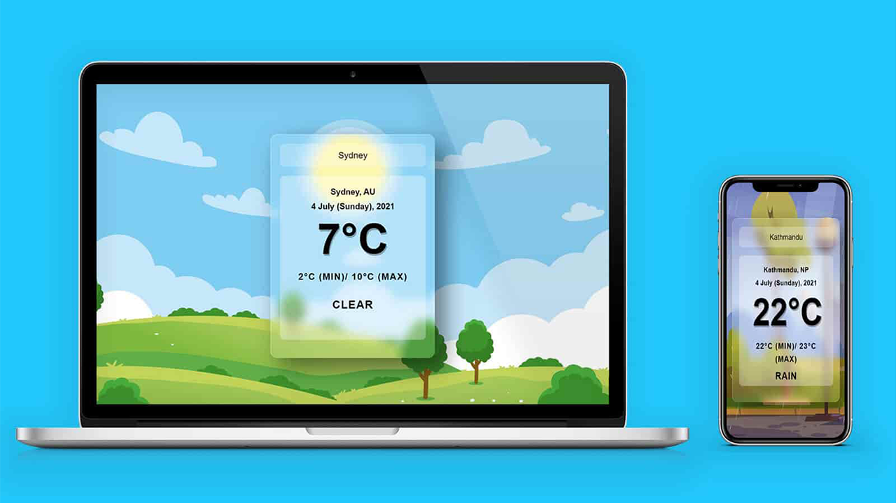

# Vanilla JavaScript Weather App

## [See Live Preview](https://jsweather-app.netlify.app/)

###  Vanilla JavaScript Weather App

- Vanilla JavaScript Weather App built using HTML, CSS, & JAVASCRIPT.
- Displays beautiful images according to the weather conditions.
- Vanilla Tilt.js is used to animate the weather card (https://micku7zu.github.io/vanilla-tilt.js/).
- API From [OpenWeatherMap](https://openweathermap.org/api) is used for feteching weather data

I don't own the photos used in this site. Freepik(https://www.freepik.com/) has all images right reserved